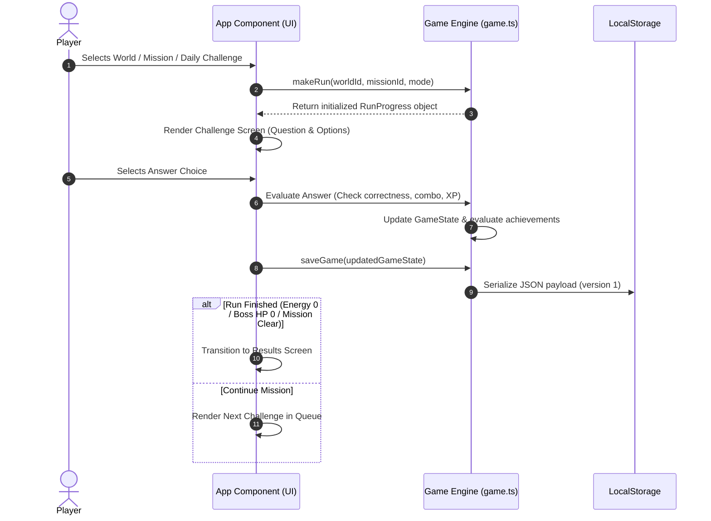

# CodeQuest ⚡

An interactive, single-page educational coding adventure built with **React**, **TypeScript**, and **Vite**. CodeQuest gamifies JavaScript learning by guiding players through 7 thematic code worlds, multi-tier missions, challenging boss battles, daily signals, and mistake review systems—all running client-side with persistent browser storage.

---

## 📑 Table of Contents

- [Overview & Key Features](#-overview--key-features)
- [Architecture Flow & Diagrams](#-architecture-flow--diagrams)
- [Project Structure](#-project-structure)
- [Core Game Mechanics & Engine Logic](#-core-game-mechanics--engine-logic)
- [Theme Engine & Contrast Design](#-theme-engine--contrast-design)
- [Data Model & Local Persistence](#-data-model--local-persistence)
- [Getting Started & Local Development](#-getting-started--local-development)
- [Accessibility & Keyboard Shortcuts](#-accessibility--keyboard-shortcuts)

---

## 🚀 Overview & Key Features

CodeQuest transforms technical problem-solving into a narrative adventure. Players assume the role of a **Code Explorer** navigating regions of the Code Core affected by software glitches.

- **7 Thematic Worlds**: Syntax Sanctuary, Data Citadel, Function Fortress, Async Realm, DOM Dominion, OOP Oasis, and Algorithm Core.
- **21 Missions & 63+ Challenges**: Typed learning modules covering choices, code output predictions, input completions, and live debugging.
- **7 Boss Encounters**: Final bosses testing multi-concept mastery with live HP tracks and dynamic attack phases.
- **Daily Signal & Practice System**: Time-stamped daily challenges with rewards and streak tracking.
- **Mistake Review Library**: Automatic tracking and categorization of incorrect answers for targeted practice.
- **Hidden Glitch Quests**: Interactive bug hunts hidden across application screens.
- **Dual Appearance Themes**: Full Dark Mode and accessible, high-contrast Light Mode.
- **Zero Backend Dependencies**: Fully functional offline with automated local storage fallback.

---

## 🏗️ Architecture Flow & Diagrams

CodeQuest follows a **decoupled unidirectional architecture**. The core UI layer ([src/App.tsx](file:///c:/Users/sjais/.copilot/repos/copilot-worktrees/osen/shivam5802-cautious-enigma/src/App.tsx)) handles view routing and presentation, delegating pure game mechanics and state updates to the Game Engine ([src/game.ts](file:///c:/Users/sjais/.copilot/repos/copilot-worktrees/osen/shivam5802-cautious-enigma/src/game.ts)) and data definitions ([src/data.ts](file:///c:/Users/sjais/.copilot/repos/copilot-worktrees/osen/shivam5802-cautious-enigma/src/data.ts)).

### High-Level System Architecture

```mermaid
flowchart TD
    subgraph UI Layer ["UI & Presentation (src/App.tsx)"]
        Navbar["Sidebar & Navigation"]
        ScreenRouter["Screen Router State"]
        ViewComponents["Page Views (Home, Map, Missions, Challenge, Profile, Settings)"]
        ModalManager["Modal Manager (Level Up, Bug Hunt, Toast Notifications)"]
    end

    subgraph Core Engine ["Game Engine (src/game.ts)"]
        StateEngine["State Mutators & Handlers"]
        XPFormula["XP & Leveling System"]
        StreakTracker["Streak & Daily Evaluator"]
        AchievementRules["Achievement Rule Evaluator"]
        SaveValidator["Save State Parser & Schema Validator"]
    end

    subgraph Data Layer ["Data & Content (src/data.ts & src/types.ts)"]
        WorldData["Worlds & Missions Catalog"]
        ChallengeCatalog["Challenge Bank & Options"]
        BossData["Boss Encounter Definitions"]
        AchievementDefs["Achievement Definitions"]
    end

    subgraph Storage ["Persistence Layer"]
        LocalStorage[("Browser LocalStorage (codequest-save-v1)")]
    end

    ViewComponents -->|Trigger Action| StateEngine
    StateEngine -->|Calculate XP/Levels| XPFormula
    StateEngine -->|Evaluate Milestones| AchievementRules
    StateEngine -->|Sync State| SaveValidator
    SaveValidator -->|JSON Serialize| LocalStorage
    LocalStorage -->|Rehydrate| SaveValidator
    SaveValidator -->|Initialize GameState| UI Layer
    WorldData -->|Provide Content| ViewComponents
```

### Game Loop Sequence Flow



---

## 📁 Project Structure

```text
shivam5802-cautious-enigma/
├── index.html                # HTML mount point & font preloads
├── package.json              # Project dependencies & scripts
├── tsconfig.json             # TypeScript build & compiler configuration
├── vite.config.ts            # Vite bundler configuration
└── src/
    ├── main.tsx              # React application entry root
    ├── App.tsx               # Main application component & screen router
    ├── game.ts               # State engine, save validation, XP & achievement rules
    ├── data.ts               # Content data for worlds, missions, challenges & bosses
    ├── types.ts              # TypeScript interface contracts & type schemas
    └── styles.css            # Complete design system, theme variables & layout rules
```

---

## ⚙️ Core Game Mechanics & Engine Logic

### 1. XP & Leveling Formula
Experience points (XP) required for advancing to the next level scale deterministically according to:

$$\text{XP}_{\text{required}}(\text{level}) = 500 + (\text{level} \times 150)$$

- **Level 1 $\rightarrow$ Level 2**: 650 XP
- **Level 2 $\rightarrow$ Level 3**: 800 XP
- **Level 3 $\rightarrow$ Level 4**: 950 XP

### 2. Combo Multiplier System
Maintaining consecutive correct answers boosts awarded XP for new challenges:

| Combo Count | Multiplier |
| :--- | :--- |
| **0 – 1** | $1.0\times$ |
| **2** | $1.2\times$ |
| **3** | $1.5\times$ |
| **4** | $2.0\times$ |
| **5+** | $3.0\times$ |

Formula: $\text{Awarded XP} = \text{Round}\left(\text{Base XP} \times \text{Hint Factor} \times \text{Combo Multiplier}\right)$  
*(Using a hint applies a $0.75\times$ factor).*

### 3. Energy & Health Mechanics
- **Mission Runs**: 3 Energy Hearts. Incorrect answers decrease energy by 1. Reaching 0 energy triggers a run failure.
- **Boss Encounters**: The Boss possesses 100 HP. Correct answers deal 34 HP damage. Defeating the boss clears the region and unlocks subsequent worlds.

---

## 🎨 Theme Engine & Contrast Design

CodeQuest includes a dual appearance system powered by CSS custom properties and scoped dataset selectors (`[data-theme="light"]`).

### Light Mode Contrast & Accessibility Specifications
To guarantee readability across all lighting conditions, Light Mode overrides default neon accents with high-contrast, WCAG 2.1 AA compliant color palettes:

- **Primary Accent (`--green`)**: Shifted from neon lime (`#b8f36b`, 1.2:1 contrast) to forest green (`#487814`, 5.5+:1 contrast ratio).
- **Secondary Accent (`--purple`)**: Deep violet (`#5c4ebc`, 5.2+:1 contrast ratio).
- **Surface Panels (`--panel`)**: High-contrast white (`#ffffff`) with subtle drop shadows.
- **Typography**: Dark slate headers (`#202638`) and muted body text (`#576075`).
- **Quiz Feedback Colors**:
  - Correct Answer Option: Deep forest text (`#254d0a`) on light green tint (`rgba(72, 120, 20, .12)`).
  - Incorrect Answer Option: Deep crimson text (`#7a182d`) on soft pink tint (`rgba(184, 46, 78, .12)`).

---

## 💾 Data Model & Local Persistence

Game state is safely stored in `localStorage` under the key `codequest-save-v1`.

### Save Schema Specification (`SaveFile` v1)

```typescript
export interface SaveFile {
  version: 1;
  savedAt: string; // ISO-8601 Timestamp
  game: GameState;
}
```

### Self-Healing Schema Validation
The game parser ([src/game.ts](file:///c:/Users/sjais/.copilot/repos/copilot-worktrees/osen/shivam5802-cautious-enigma/src/game.ts#L31-L91)) performs runtime verification on loaded JSON objects:
- Validates field types and numeric bounds (non-negative XP, coins, integer levels).
- Filters out obsolete or corrupted challenge IDs.
- Validates active run integrity (index bounds, energy ranges).
- Gracefully falls back to a fresh state if data corruption occurs.

---

## 🛠️ Getting Started & Local Development

### Prerequisites
- **Node.js**: v18.0.0 or higher
- **npm**: v9.0.0 or higher

### Installation & Run Commands

1. **Clone the repository and install dependencies**:
   ```bash
   npm install
   ```

2. **Launch development server**:
   ```bash
   npm run dev
   ```
   Open your browser at `http://localhost:5173`.

3. **Type Check & Production Build**:
   ```bash
   npm run build
   ```

4. **Preview Production Build**:
   ```bash
   npm run preview
   ```

---

## ⌨️ Accessibility & Keyboard Shortcuts

CodeQuest features keyboard navigation and accessibility integrations:

- <kbd>Enter</kbd>: Submit selected answer / Continue to next challenge.
- <kbd>Esc</kbd>: Close modal overlays (Level Up, Bug Hunt, Mobile Nav).
- <kbd>P</kbd>: Pause active challenge and return to Home.
- **Reduced Motion**: Full support for `prefers-reduced-motion: reduce` and in-game animation toggle.
- **ARIA Standards**: Dialog roles (`role="dialog"`), live regions, and semantic landmarks.

---

*Built with passion by the CodeQuest Development Team.*
